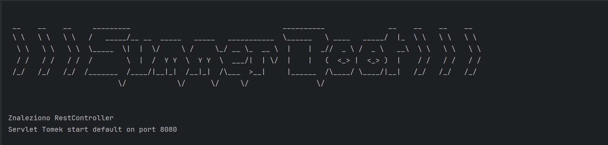
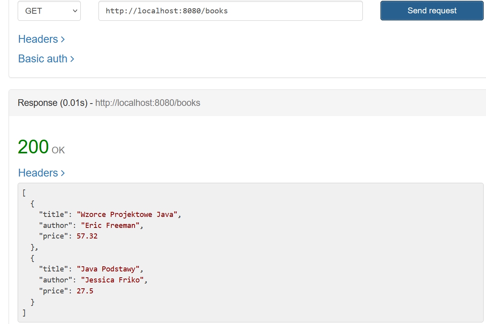

## Wprowadzenie
Projekt SummerBoot został stworzony w celu zgłębienia fundamentalnych aspektów działania frameworka Spring Boot oraz wykorzystania standardowych bibliotek z pakietu `java.net` do tworzenia aplikacji sieciowych. Projekt ten umożliwia praktyczne zrozumienie i naukę takich zagadnień, jak przetwarzanie protokołu HTTP, dekodowanie strumieni bajtów oraz wykorzystanie mechanizmów refleksji dostępnych w Javie.

## Jak uruchomić
`git clone https://github.com/BigMoistLochu/SummerBootProject.git`

## Cele edukacyjne
SummerBoot ma na celu dostarczenie praktycznego doświadczenia w następujących obszarach:
- **Zrozumienie i implementacja podstawowych komponentów aplikacji sieciowej** wykorzystującej Spring Boot, w tym konfiguracja i zarządzanie serwerem aplikacyjnym.
- **Praca z bibliotekami `java.net`** do tworzenia i obsługi połączeń sieciowych.
- **Obsługa protokołu HTTP**: Analiza, jak dane są przesyłane przez Internet za pomocą HTTP, oraz nauka dekodowania i kodowania wiadomości HTTP.
- **Refleksja w Javie**: Wykorzystanie refleksji do dynamicznego zarządzania klasami i obiektami w czasie wykonania programu.

## Technologie

* Java 11+
* Maven

### Rezultat dzialania

